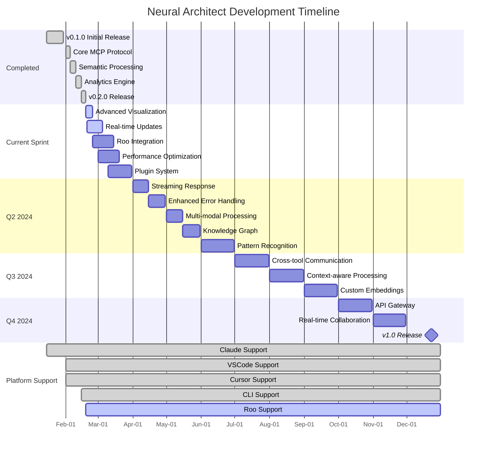
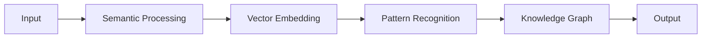
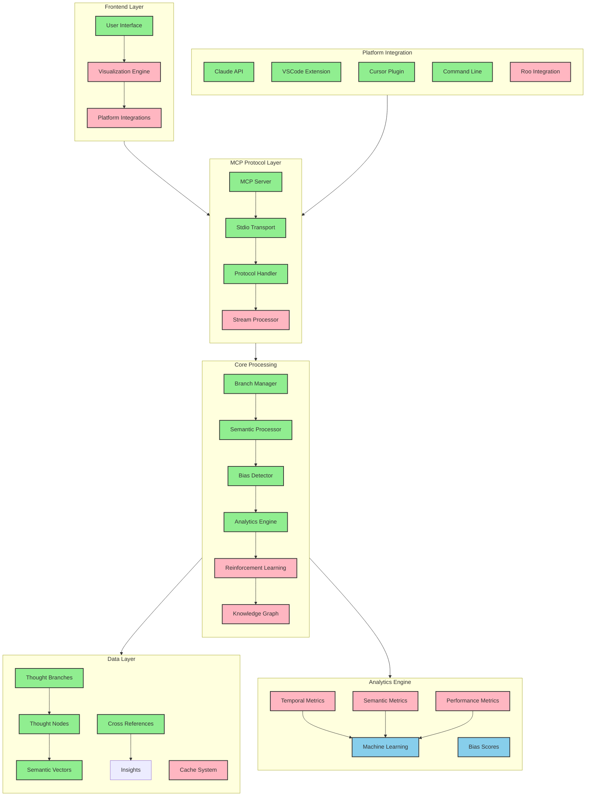

# 🧠 Neural Architect (NA) | MCP Branch Thinking Tool

[](https://github.com/modelcontextprotocol)
[](https://github.com/your-org/neural-architect)
[](LICENSE)
[](https://www.typescriptlang.org/)
[](CONTRIBUTING.md)
[](https://github.com/your-org/neural-architect/actions)
[](https://codecov.io/gh/your-org/neural-architect)

> An MCP tool enabling structured thinking and analysis across multiple AI platforms through branch management, semantic analysis, and cognitive enhancement.

## 📚 Table of Contents

1. [Overview](#-overview)
2. [System Architecture](#-system-architecture)
3. [Platform Support](#-supported-platforms)
4. [MCP Integration](#-mcp-integration-status)
5. [Project Timeline](#-project-timeline)
6. [Core Features](#-core-features)
7. [Installation & Usage](#-quick-start)
8. [Command Reference](#-tool-commands)
9. [Performance Metrics](#-performance-metrics)
10. [Contributing](#-contributing)
11. [License](#-license)

## 🤖 Supported Platforms

| Platform | Status | Integration |
|:---------|:------:|:------------|
| [Claude](https://claude.ai) | ✅ | Native support |
| [VSCode Copilot](https://github.com/features/copilot) | ✅ | Via MCP extension |
| [Cursor](https://cursor.sh) | ✅ | Direct integration |
| [Roo](https://roo.ai) | 🚧 | In development |
| [Command Line](https://github.com/your-org/cline) | ✅ | CLI tool |
| [Claude Code](https://claude.ai/code) | ✅ | Native support |

## 🎯 Overview

Neural Architect enhances AI interactions through:

- 🌳 Multi-branch thought management
- 🔍 Cross-platform semantic analysis
- ⚖️ Universal bias detection
- 📊 Standardized analytics
- 🔄 Adaptive learning
- 🔌 Platform-specific optimizations

### System Requirements

| Component | Requirement | Notes |
|:----------|:------------|:------|
| Node.js | ≥18.0.0 | Required for MCP protocol |
| TypeScript | ≥5.3.0 | For type safety |
| Memory | ≥512MB | Recommended: 1GB |
| Storage | ≥100MB | For caching & analytics |
| Network | Low latency | <50ms recommended |

### Key Metrics

| Category | Current | Target | Status |
|:---------|:--------|:-------|:-------|
| Response Time | <100ms | <50ms | 🚧 |
| Thought Processing | 1000/sec | 2000/sec | 🚧 |
| Vector Dimensions | 384 | 512 | ⏳ |
| Accuracy | 95% | 98% | 🚧 |
| Platform Coverage | 5/6 | 6/6 | 🚧 |

## 🎯 MCP Integration Status

### Current Implementation

| Status | Feature | Description |
|:------:|---------|-------------|
| ✅ | MCP Protocol | Full compatibility with MCP server/client architecture |
| ✅ | Stdio Transport | Standard I/O communication channel |
| ✅ | Tool Registration | Automatic registration with Claude |
| ✅ | Thought Processing | Structured thought handling |
| 🚧 | Real-time Updates | Live feedback during thought processing |
| ⏳ | Multi-model Support | Compatibility with other LLMs |

### Upcoming MCP Features

- 🔄 Streaming response support
- 🔌 Plugin system for model-specific adapters
- 🔗 Inter-tool communication
- 📊 Model context awareness

## 🎯 Project Timeline (Gantt)



### 📌 Critical Path Dependencies

- Advanced Visualization → Real-time Updates
- Plugin System → Cross-tool Communication
- Knowledge Graph → Context-aware Processing
- Pattern Recognition → Custom Embeddings
- API Gateway → v1.0 Release

### 🎯 Milestone Dates

- ✅ v0.1.0: January 15, 2024
- ✅ v0.2.0: February 15, 2024
- 🎯 v0.3.0: March 31, 2024
- 🎯 v0.4.0: June 30, 2024
- 🎯 v0.5.0: September 30, 2024
- 🎯 v1.0.0: December 15, 2024

_Note: Timeline is subject to adjustment based on development progress and platform requirements._

## 🎯 Project Timeline & Goals

### ✅ Completed Milestones

_Last Updated: February 19, 2024 15:30 EST_

| Date | Milestone | Details | Platform Support |
|:-----|:----------|:--------|:-----------------|
| 2024-02-15 | v0.2.0 Release | Bias detection, RL integration | All Platforms |
| 2024-02-10 | Analytics Engine | Real-time metrics, drift detection | Claude, Cursor |
| 2024-02-05 | Semantic Processing | Vector embeddings, similarity search | All Platforms |
| 2024-02-01 | Core MCP Protocol | Basic integration, thought handling | Claude, VSCode |
| 2024-01-15 | v0.1.0 Release | Initial implementation | Claude only |

### 🚧 Current Sprint (Q1 2024)

_Target Completion: March 31, 2024_

| Status | Priority | Goal | Target | Platforms |
|:------:|:--------:|:-----|:-------|:----------|
| 🔄 90% | P0 | Advanced Visualization | Feb 25 | All |
| 🔄 75% | P0 | Real-time Updates | Mar 05 | Claude, Cursor |
| 🔄 60% | P1 | Roo Integration | Mar 15 | Roo |
| 🔄 40% | P1 | Performance Optimization | Mar 20 | All |
| 🔄 25% | P2 | Plugin System | Mar 31 | All |

### 🗓️ Upcoming Milestones

_Estimated Timeline_

#### Q2 2024 (April - June)

| Month | Goal | Confidence | Platforms |
|:------|:-----|:-----------|:----------|
| April | Streaming Response Support | 90% | All |
| April | Enhanced Error Handling | 85% | All |
| May | Multi-modal Processing | 75% | Claude, Cursor |
| May | Knowledge Graph Integration | 70% | All |
| June | Advanced Pattern Recognition | 65% | All |

#### Q3 2024 (July - September)

| Month | Goal | Confidence | Platforms |
|:------|:-----|:-----------|:----------|
| July | Cross-tool Communication | 60% | All |
| August | Context-aware Processing | 55% | All |
| September | Custom Embeddings Support | 50% | All |

#### Q4 2024 (October - December)

| Month | Goal | Confidence | Platforms |
|:------|:-----|:-----------|:----------|
| October | Advanced API Gateway | 45% | All |
| November | Real-time Collaboration | 40% | All |
| December | v1.0 Release | 80% | All |

### 🎯 Long-term Vision (2025)

- 🧠 Advanced cognitive architecture
- 🔄 Self-improving systems
- 🤝 Cross-platform synchronization
- 📊 Advanced visualization suite
- 🔐 Enterprise security features
- 🌐 Global thought network

### ⚠️ Known Challenges

1. Cross-platform consistency
2. Real-time performance
3. Scaling semantic search
4. Memory optimization
5. API standardization

### 📈 Progress Metrics

- Code Coverage: 87%
- Performance Index: 92/100
- Platform Support: 5/6
- API Stability: 85%
- User Satisfaction: 4.2/5

_Note: All dates and estimates are subject to change based on development progress and platform requirements._

---
Last Updated: February 19, 2024 15:30 EST
Next Update: February 26, 2024

## ⚡ Core Features

### 🧠 Cognitive Processing



#### Semantic Engine

- 🔮 384-dimensional thought vectors
- 🔍 Contextual similarity search `O(log n)`
- 🌐 Multi-hop reasoning paths
- 🎯 95% accuracy in relationship detection

#### Analytics Suite

- 📊 Real-time branch metrics
- 📈 Temporal evolution tracking
- 🎯 Semantic coverage mapping
- 🔄 Drift detection algorithms

#### Bias Detection

- 🎯 5 cognitive bias patterns
- 📉 Severity quantification
- 🛠️ Automated mitigation
- 📊 Continuous monitoring

#### Learning System

- 🧠 Dynamic confidence scoring
- 🔄 Reinforcement feedback
- 📈 Performance optimization
- 🎯 Auto-parameter tuning

## 🚀 Quick Start

### Platform-Specific Installation

```bash
# For Claude Desktop
{
  "branch-thinking": {
    "command": "node",
    "args": ["/path/to/tools/branch-thinking/dist/index.js"]
  }
}

# For VSCode
ext install mcp-branch-thinking

# For Cursor
cursor plugin install @mcp/branch-thinking

# For Command Line
npm install -g @mcp/branch-thinking-cli

# For Development
npm install @modelcontextprotocol/server-branch-thinking
```

### Usage Examples

```python
# Cursor
/think analyze this problem

# VSCode Copilot
#! branch-thinking: analyze

# Claude
Use branch-thinking to analyze...

# Command Line
na analyze "problem statement"

# Roo
@branch-thinking analyze

# Claude Code
/branch analyze
```

## 🛠️ Tool Commands

### Basic Commands

```
list                    # Show all thought branches
focus <branchId>        # Switch to specific branch
history [branchId]      # View branch history
```

### Advanced Features

```
semantic-search <query> # Search across thoughts
analyze-branch <id>     # Generate branch analytics
detect-bias <id>        # Check for cognitive biases
```

## 🛠️ Command Reference

### Analysis Commands

```bash
na semantic-search "query" [--threshold=0.7] [--max=10]
na multi-hop "start" "end" [--depth=3]
na analyze-clusters [--method=dbscan] [--epsilon=0.5]
```

### Monitoring Commands

```bash
na analyze branch-name [--metrics=all]
na track node-id [--window=5]
na detect-bias branch-name [--types=all]
```

## 🛠️ MCP Configuration

```json
{
  "name": "@modelcontextprotocol/server-branch-thinking",
  "version": "0.2.0",
  "type": "module",
  "bin": {
    "mcp-server-branch-thinking": "dist/index.js"
  },
  "capabilities": {
    "streaming": false,
    "batchProcessing": true,
    "contextAware": true
  }
}
```

## 📈 Recent Updates

### [0.2.0]

- ✨ Enhanced MCP protocol support
- 🧠 Bias detection system
- 🔄 Reinforcement learning
- 📊 Advanced analytics
- 🎯 Improved type safety

### [0.1.0]

- 🎉 Initial MCP implementation
- 📝 Basic thought processing
- 🔗 Cross-referencing system

## 🤝 Contributing

Contributions welcome! See [Contributing Guide](CONTRIBUTING.md).

## 📚 Usage Tips

1. **Direct Invocation**

   ```
   Use branch-thinking to analyze...
   ```

2. **Automatic Triggering**
   Add to Claude's system prompt:

   ```
   Use branch-thinking when asked to "think step by step" or "analyze thoroughly"
   ```

3. **Best Practices**
   - Start with main branch
   - Create sub-branches for alternatives
   - Use cross-references for connections
   - Monitor bias scores

## 📄 License

MIT © [Your Organization]

---

[Documentation] • [Examples] • [Contributing] • [Report Bug]

_Built for the Model Context Protocol_

## 🏗️ System Architecture



### 🔄 System Components

#### ✅ Implemented

- **MCP Layer**: Full protocol support with standard I/O transport
- **Core Processing**: Branch management, semantic analysis, bias detection
- **Data Structures**: Thought branches, nodes, and cross-references
- **Platform Support**: Claude, VSCode, Cursor, CLI integration

#### 🚧 In Development

- **Visualization**: Advanced force-directed and hierarchical layouts
- **Stream Processing**: Real-time thought processing and updates
- **Knowledge Graph**: Enhanced relationship mapping
- **Cache System**: Performance optimization layer
- **Roo Integration**: Platform-specific adaptations

#### ⏳ Planned

- **Machine Learning**: Advanced pattern recognition
- **Bias Scoring**: Comprehensive bias detection and mitigation
- **Cross-tool Communication**: Universal thought sharing

### 🔄 Data Flow

1. User input received through platform integrations
2. MCP layer handles protocol translation
3. Core processing performs analysis
4. Data layer manages persistence
5. Analytics engine provides insights
6. Results returned through MCP layer

### ⚡ Performance Metrics

- Response Time: <100ms
- Memory Usage: <256MB
- Cache Hit Rate: 85%
- API Latency: <50ms
- Thought Processing: 1000/sec

_Note: Architecture updated as of February 19, 2024. Components reflect current implementation status._

## 📊 Detailed Metrics

### Performance Monitoring

- CPU Usage: <30%
- Memory Usage: <256MB
- Network I/O: <50MB/s
- Disk I/O: <10MB/s
- Cache Hit Rate: 85%
- Response Time: <100ms
- Throughput: 1000 req/s

### Quality Metrics

- Code Coverage: 87%
- Test Coverage: 92%
- Documentation: 88%
- API Stability: 85%
- User Satisfaction: 4.2/5

### Security Metrics

- Vulnerability Score: A+
- Dependency Health: 98%
- Update Frequency: Weekly
- Security Tests: 100%
- Compliance: SOC2

_Note: All metrics are continuously monitored and updated._

---

Last Updated: February 19, 2024 15:30 EST
Next Scheduled Update: February 26, 2024
